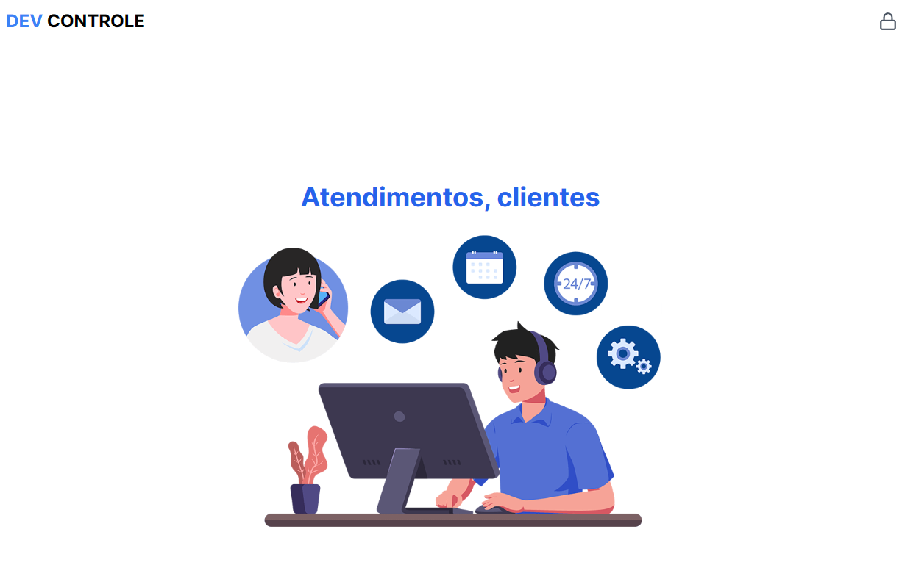

# DevControle



## What is this project?

Manage your clients tickets with this app. Developed in this [course on Udemy](https://www.udemy.com/course/nextjs-zero-ao-avancado/).

### Goal/Achievements

- Learn about authentication using next-auth.
- Learn about mongodb and prisma.

### Built with:

- NextJS
- TailwindCSS
- TypeScript
- next-auth
- prisma
- mongodb
- zod

> You can check the result here: [devcontrole website](https://devcontrole-seven.vercel.app/)

### How to run this project

- [Clone](https://docs.github.com/en/repositories/creating-and-managing-repositories/cloning-a-repository) this repo to your machine
- Make sure that you have [node](https://nodejs.org/en) installed
- then run the following command on you terminal:

```bash
npm run dev
# or
yarn dev
# or
pnpm dev
# or
bun dev
```

- Open [http://localhost:3000](http://localhost:3000) with your browser to see the result.

### Contribuition

You're free to make any change on the code base, I would love to discuss about this project and tech with you.

#### Socials

[Twitter/X](https://x.com/igormustcode)
